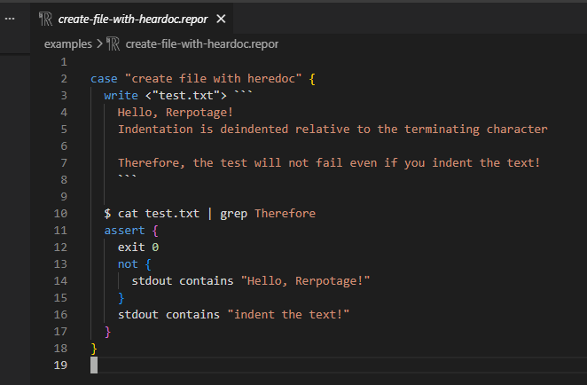
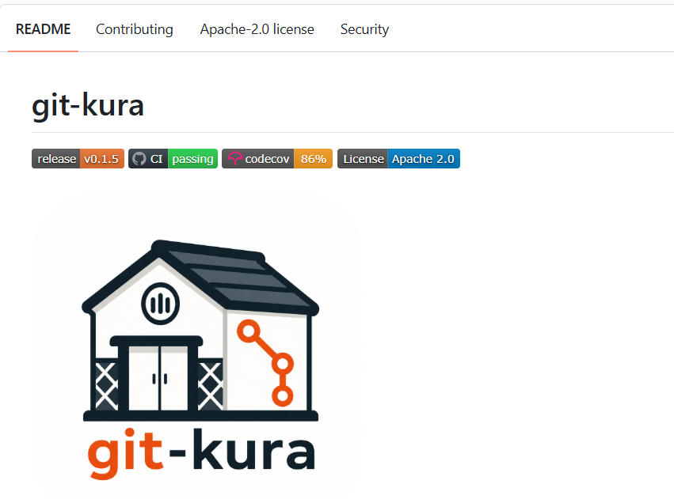
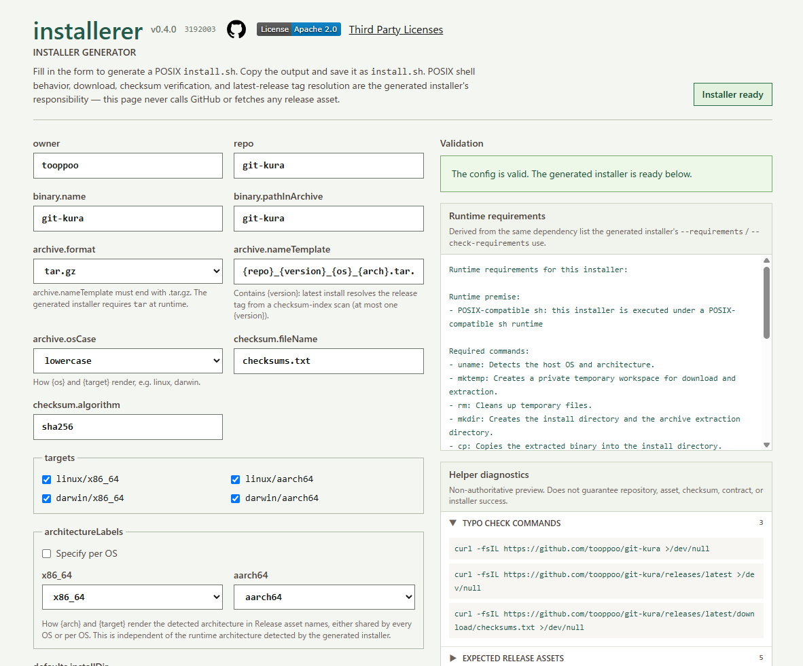

::caption::

# OSS開発を通じて考える AI開発のこれから

::info::

2026-07-21

SAPPORO ENGINEER BASE #15

#seb_sapporo

@Philomagi

<!--
2026年前半の振り返りと、後半への方針表明。
4つのOSSを個別紹介ではなく、AI開発で生じた問題への対処事例として話す。
-->

---
src: ./pages/profile.md
---

---
layout: talk-content
---

# 2026年前半に変わったこと

<v-clicks>

- Claude や Codex を使い、個人でも複数のOSSを並行して開発できた
- コードを書くこと自体の負荷は下がった
- 実装レイヤの代わりに、違うレイヤの負荷が大きくなりつつある

</v-clicks>

<!--
まず「これまで」を置く。
生産量と並行性は上がった、というのが前半の実感。
その裏で重くなった問いを次のスライドで開く。
-->

---
layout: talk-content
---

# 負荷の比重が大きくなったレイヤ

<v-clicks>

- 複数AIエージェントの作業をどう分離するのか
- どこまでをAIエージェントに任せ、どこからは任せないのか
- **生成された実装が正しいかを、どう確かめるのか**

</v-clicks>

> ※ 作業状態の管理、AIに委任する範囲、生成結果の不確実性が、問題の中心になった

<!--
問いを3つに絞る。
どれも「コードの書き方」ではなく「不確実さの扱い方」の問い。
-->

---
layout: talk-content
---

# 開発スタイル・方針の変化

<v-clicks>

- 複数のAIエージェントに並行で作業させる
- 「生成する仕組み」をAIに生成させる
  - プログラム、ドキュメントなど
- 実装結果は逐語的に読むより、全体構造と入出力の結果検証を重視

</v-clicks>

> 並行実装、自動生成の実装、入出力契約の検証に重点が移動

---
layout: talk-diagram
---

# 開発における2つの領域

  <ul>
    <li>ファジー＝揺れが残り、同じ入力が必ずしも同じ結果とならない領域</li>
    <li>決定論的＝同じ入力なら同じ結果になる領域</li>
  </ul>
  

    

      
ファジー

      

        人間とAIが 探索・判断する
      

    

    

      
決定論的

      

        プログラムで 自動化・定式化する
      

    

  

  

> ファジーな領域が残ることは受け入れつつ、決定論的に扱える領域を増やす

  

---
layout: talk-diagram
---

# OSS開発を通じてのアプローチ

  

    
並行作業の衝突を防ぐ

    
→

    git-kura
  

  

    
コードを生成するコード

    
→

    installerer
  

  

    
入出力特化のE2E

    
→

    reportage
  

> ファジーな領域を減らす + 人間が注意を払う範囲を限定するためのOSS開発

---
layout: talk-content
---

# reportage : 入出力特化のE2Eテスト

<v-clicks>

- 入出力を実装言語から独立して検証する
- 標準出力・エラー出力・終了コード・ファイルの検証に特化
- AIが内部実装を頻繁に変えるほど、外部から見た挙動を固定する価値が上がる

</v-clicks>

> 詳細ではなく、観測可能な振る舞いの検証に焦点を当てる

> 人間は、観測可能な振る舞いへ重点的に注意を向ける

<!--
Goのtestscriptは有用だが、Go依存で構造化も弱かった。
実装言語から独立させたくて作った。
AIがどう実装したかではなく、外から観測できる契約を見る。
-->

---
layout: talk-diagram
---

# reportage : 実際のコード例

{style="width:auto; height:400px; margin:auto;"}

---
layout: talk-content
---

# git-kura : 並行作業の衝突検知

<v-clicks>

- worktree を作業単位として分離
- 変更対象のファイルを明示的に宣言させる
- 競合を機械的に検出し、非ゼロ終了でAIの処理を止める
- コンフリクト発生後ではなく、編集・コミット前に止める

</v-clicks>

> AIの出力・作業内容は揺れても、作業領域と競合状態は機械的に判定する

<!--
AIが活動する環境を決定論的に管理する。
worktree＝同じGitリポジトリから複数の独立した作業場所を作る仕組み。
git-kuraは要求仕様そのものの曖昧さは解消しない。
-->

---
layout: talk-diagram
---

# git-kura : 実際の衝突ログ

{style="width:auto; height:400px; margin:auto;"}

---
layout: talk-content
---

# installerer : installerの機械的生成

<v-clicks>

- install.sh をAIから生成すると、入力規約や出力結果がブレる可能性
  - 結果を安定して保障できない
- install.sh を生成するためのツール = `installerer` を、AIを使って作成
- `installerer` は、同じ入力には常に同じ shell script を生成する

</v-clicks>

> コードではなく、コードを作るコードをAIで作る

> コードによるコード生成結果は安定して検証可能

<!--
install.sh を CLI ごとに書くのが面倒だった。
毎回書く代わりに、配布の規約（資産の命名やチェックサム）を入力として宣言し、installerer で install.sh を生成する。
installerer 自身が生成器で、その正しさは reportage の E2E で確かめる。
「毎回 AI に書かせず、決定論的に生成する」位置づけ。
-->

---
layout: talk-diagram
---

# installerer : web UI

{style="width:auto; height:450px; margin:auto;"}

---
layout: talk-diagram
---

# 3つを統合するモデル

  
曖昧な要求を、人間とAIで探索する

  
↓

  

    

      作業の制約を明示
      git-kura
    

  

  
↓

  

    

      安定した結果を得る仕組み作り
      installerer
    

  

  
↓

  

    

      外部挙動の重点的検証
      reportage
    

  

> 制約を明示し、結果を安定させ、外部契約に注力する

<!--
3つを個別のツールではなく、1本の流れの各層として見せる。
-->

---
layout: talk-content
---

# これまでとこれから

<v-clicks>

- （これまで）AIにより、開発速度と並行性は向上した
  - 問題の中心は、実装よりも並行実装・委任範囲・生成結果の不確実性へ
- （これから）ファジーな領域と決定論的な領域を分離し、後者を検証可能にする
- ファジーな領域は無くせないことを前提に、いかに決定論的領域に寄せ、注力すべき範囲を絞るか
  - AIの登場により、現実的な範囲になってきた？

</v-clicks>

> AIを前提としつつ、検証可能・把握可能な仕組みを構築する開発へ

---
layout: talk-content
---

# これから作りたいもの

<v-clicks>

- 仕様の記述に形式手法を取り入れたい
- 形式手法で証明された仕様と、実装・テストの対応関係がネック
- 仕様-テスト（戦略、設計、ケース）-E2E実装を紐づけるツールを作る？
  - それぞれのartifactをnominal typeと見なして、リンクさせる
  - 関連付けが保証された仕様・テスト・E2E実装
- 仕様、テスト、E2E実装を見れば「OK」と判断できる環境づくりが目標

</v-clicks>

<!--
イベントの「これから」に接続する。
「もっと任せる」を目的化せず、境界を作ることを目的にする。
-->
